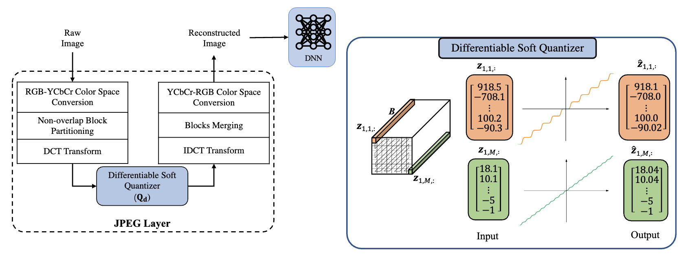
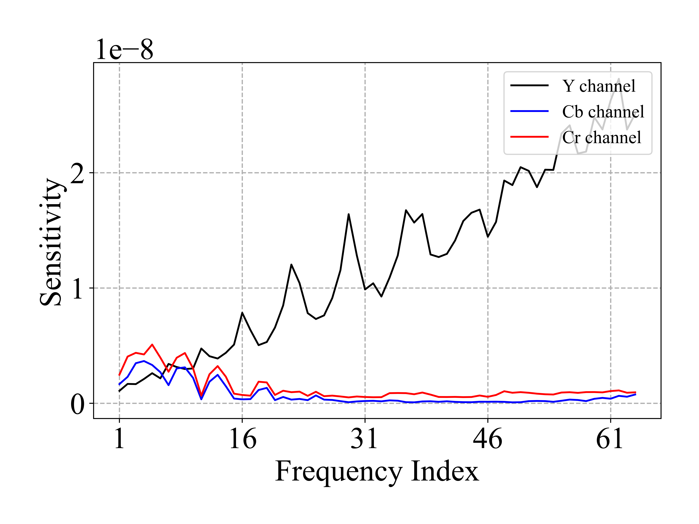
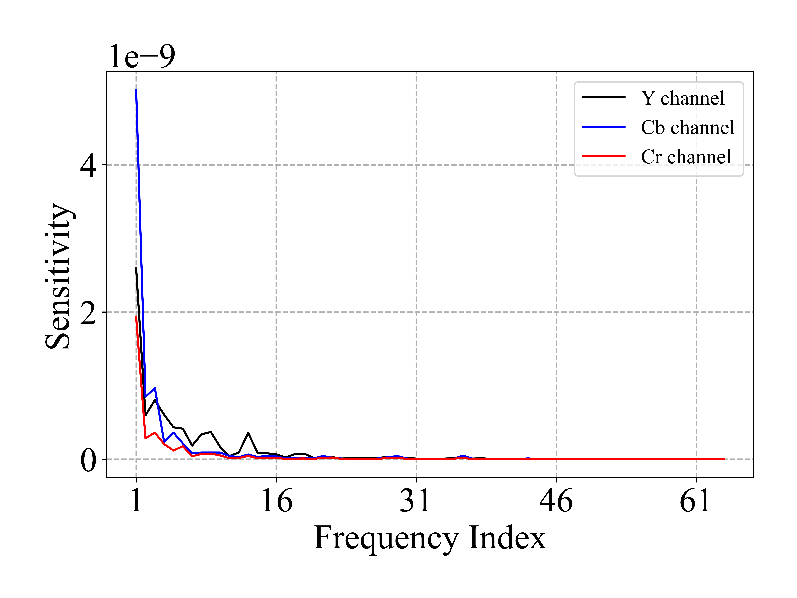
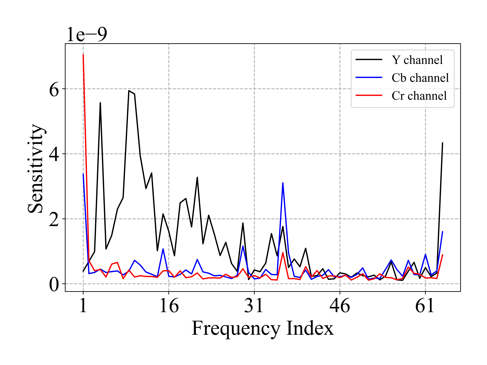
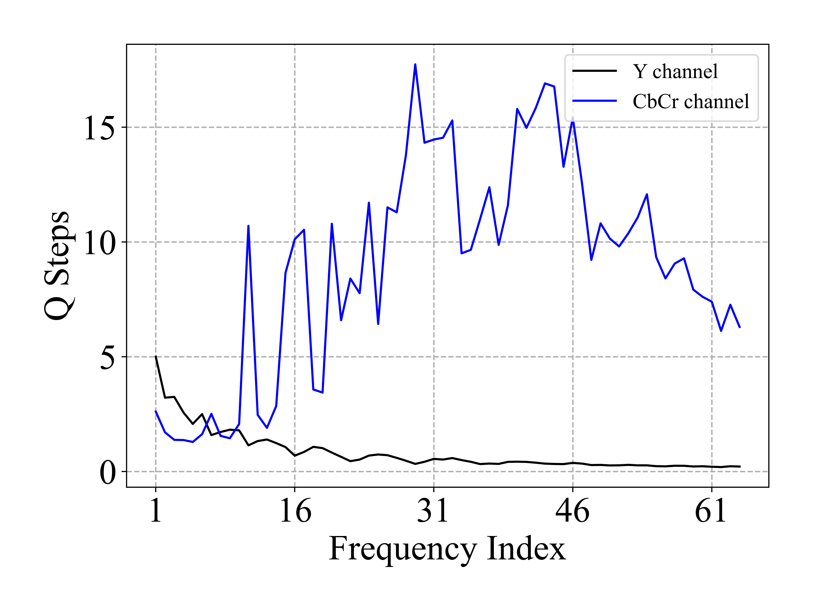
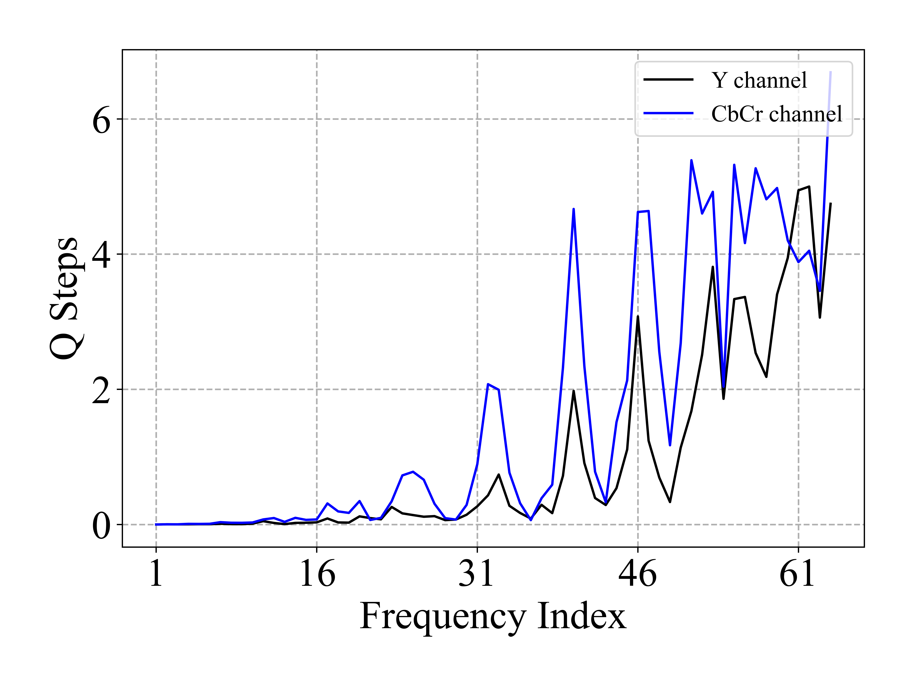
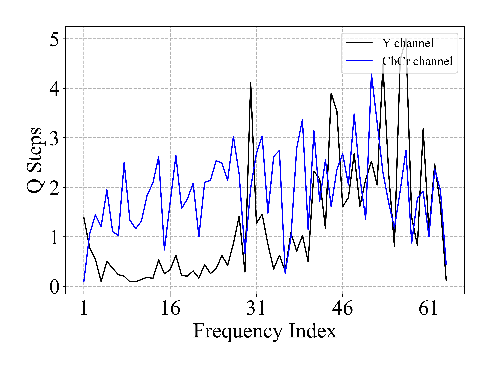

# JPEG-Inspired-DL

This repo is for reproducing the ImageNet experimental results in our paper [*JPEG Inspired Deep Learning*] submitted at ICLR 2025.

<p align="center">

</p>

## Installation

The repo is tested with Python 3.8, CUDA 11.7, and based on the 'requirements.txt' file provided.


## Training JPEG-DL

```
    python3.8 train_teacher_cifar_JPEG.py \
            --model ${mode} --JEPG_learning_rate 0.003 --JEPG_alpha 5.0 \
            --JPEG_enable --alpha_fixed --initial_Q_w_sensitivity

```

## Senstivity Estimation

Fetch the pretrained models used for driving the senstivity by:

    ```
    sh scripts/fetch_pretrained_cifar100.sh
    ```
which will download and save the models to `save/models`

### Senstivity Plots

<p align="center">
    <figure style="display: inline-block; margin: 6px;">
        
        <figcaption>CIFAR-100 (resnet110)</figcaption>
    </figure>
    <figure style="display: inline-block; margin: 6px;">
        
        <figcaption>Flowers (resnet18)</figcaption>
    </figure>
    <figure style="display: inline-block; margin: 6px;">
        
        <figcaption>Flowers (efficientformer_l1)</figcaption>
    </figure>
</p>


### Initialization of Q Tables
Based on the drived Senstivity, we have followed the following steps to initialize the Q-Tables for JPEG-DL.

```
    def normalize(arr, factor):
        if factor == 0:
            factor = np.max(arr)
        arr = arr/factor
        return arr, factor

    Y_sens               = 1 / Y_sens 
    CbCr_sens            =  2 / (Cb_sens + Cr_sens)
    _    , factor        = normalize(Y_sens   , 0)
    factor               = factor / q_max
    Y_sens    , _        = normalize(Y_sens   , factor)
    CbCr_sens , _        = normalize(CbCr_sens, factor)
```

<p align="center">
    <figure style="display: inline-block; margin: 6px;">
        
        <figcaption>CIFAR-100 (resnet110)</figcaption>
    </figure>
    <figure style="display: inline-block; margin: 6px;">
        
        <figcaption>Flowers (resnet18)</figcaption>
    </figure>
    <figure style="display: inline-block; margin: 6px;">
        
        <figcaption>Flowers (efficientformer_l1)</figcaption>
    </figure>
</p>


## Robustness Testing

1. Test Robustness for the learned model 

    ```
    python3 robustness_JPEG.py --model ${mode} \
                                    --alpha_fixed --JPEG_enable \
                                    --model_dir ${model_dir}
    ```

2. Test Robustness for the standard model 

    ```
    python3 robustness_JPEG.py --model ${mode} --model_dir "./save/models/${mode}_vanilla/ckpt_epoch_240.pth
    ```


## Acknowledgements

This repo is based on the code given in [RepDistiller](https://github.com/HobbitLong/RepDistiller) for CIFAR-100 and [PyTorch](https://github.com/pytorch/vision/tree/main/references/classification#resnet) for ImageNet. Also, we use [Transformer-based](https://github.com/OscarXZQ/weight-selection.git) to produce our results for Transformer-based models. 
